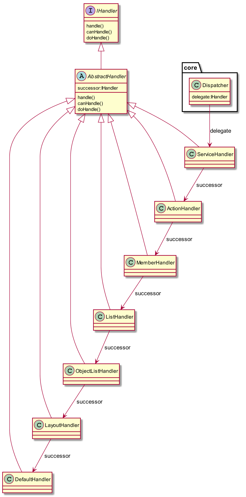
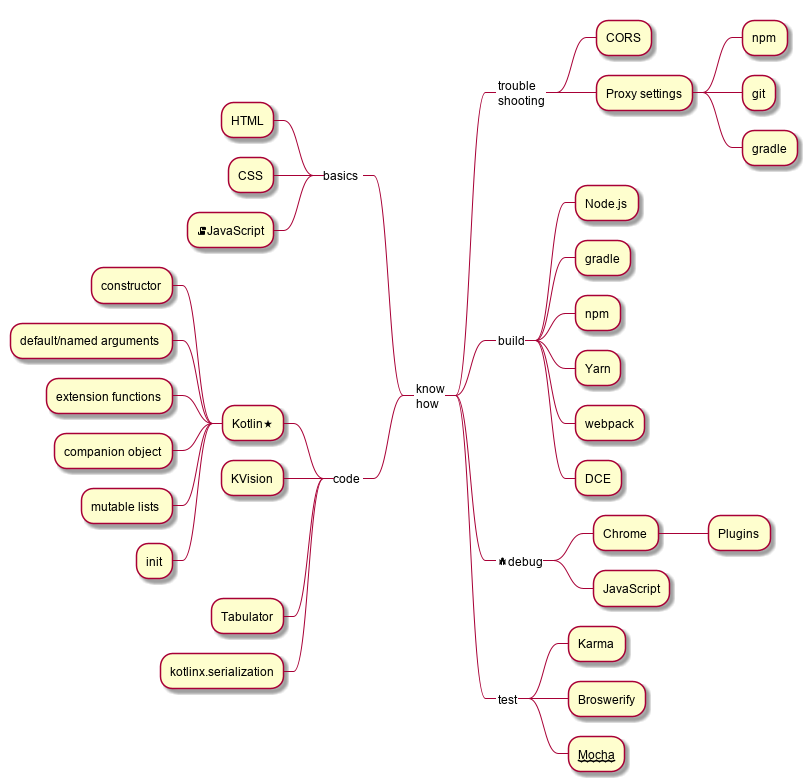
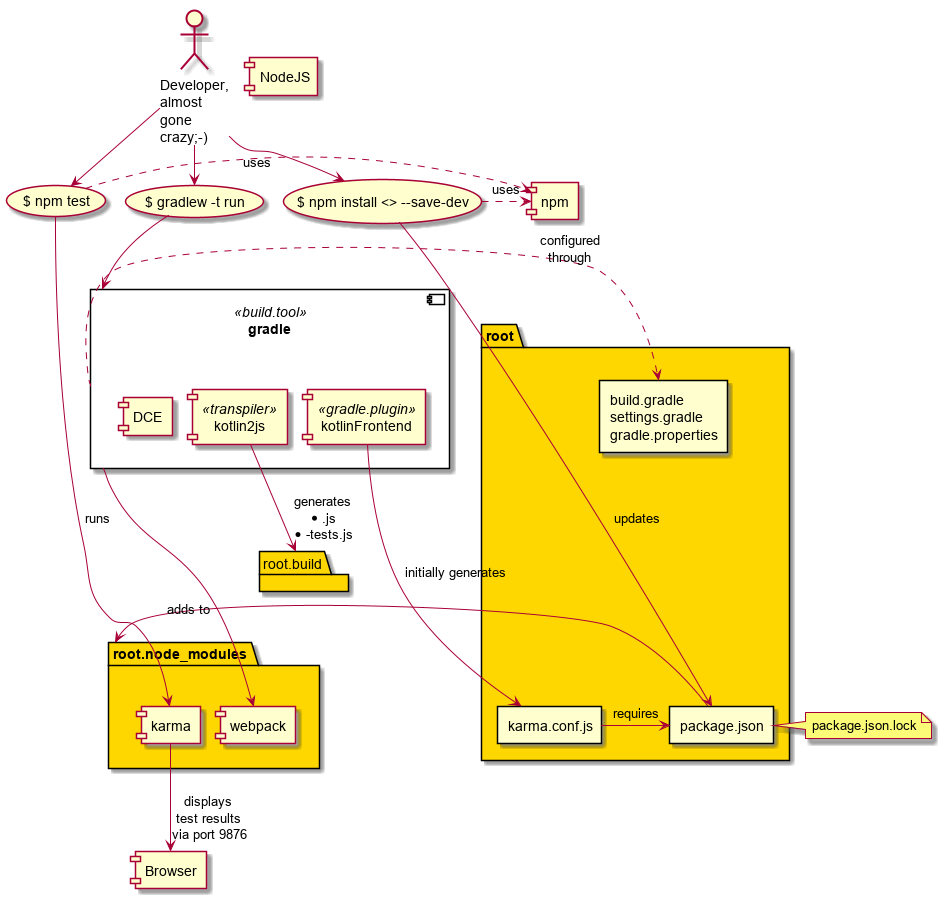

#Quickstart
TIP: Originally Apache Isis SimpleApp 1.16.0 was used as the reference RO backend.
This required some extra steps in order to deal with CORS setup, see sections on pre 2.0.0-M3 and CORS.

## Frontend
 
### Requirements
Kotlin/JS uses `Gradle` for the build, for the JS runtime `NodeJS`, and for the JS dependency management part `npm`.
You should have installed:
* node js (https://nodejs.org/en/download/current/)
* Apache Gradle 
* Google Chrome (72.0.3626.81 or higher)
* <Moesif CORS Plugin (for Chrome)

### Build
gradle is run under Windows with gitbash:

* ./gradlew.bat tasks # list all gradle tasks
* ./gradlew.bat webpack-bundle # create main.bundle.js
* ./gradlew.bat test --exclude-task npm-install
 
Internally gradle uses npm for the JS part.
```
 npm --verbose 
``` 
 If task npm-install hangs, try
``` 
 ./gradlew.bat npm-install --info --debug --stacktrace
```
Helps in identifying thing that may go wrong (eg. due to proxy settings).

### Run
```
gradlew.bat -t run
```

## Backend
### Via Docker Image
// TODO insert to AI reference /doc


# Design
In the following section you'll find information that likely helps understanding the implementation.  
## Overview


## Patterns Applied 
### Redux
The implementation is an (independent) reinvention of Redux. 
I prefer the name Aggregator over Reducer though - IIRC Aggregator is prior art.
### Half Object Protocol
The HOP pattern dates back to the early 2000, namely CanooULC.
IMO Naked Objects together with the RO API and kroViz resembles something similar.
### Transfer Object (JEE / EAA)
TO's are created from JSON responses
### Event Sourcing (EAA)
Requests, reponses, and resulting TO's are logged. 
Before requests are sent out to the server this log is consulted and used as a cache.
### Proxy (GOF)
The event source acts as a Proxy and thereby saves time and bandwidth.
### Aggregator (EAI)
Various aggregators are responsible to collect or assemble displayable objects.
Once all layout information is there, the UI will be rendered, even if not all elements of a list 
have arrived. Those elements will be added as they arrive. This is done with the help of
mutable lists. 
### Chain of Responsibility (GOF)
A chain of handlers is used to identify what kind of TO is to be generated from the 
JSON response. Handlers are responsible for initial assignment of aggregators.

### Template Method (GOF)
The Handler base class makes use of this pattern. Some methods have to be implemented
in each subclass, in some cases the default implementation in the base class is used.
### Composite Pattern (GOF)
UI elements are hierarchically grouped, cf. *layout.xml
### Factory (GOF)
Used for building tables dynamically.
### Remote Facade
The Restful Objects API.

# Trouble Shooting
   
## Corporate Firewall with SSL 'inspection'
There are some questionable setups in coporate settings that are based on SSL replacement.
In order to cope with it, you may try to import the Certificate into cacerts, 
see https://intellij-support.jetbrains.com/hc/en-us/community/posts/115000094584-IDEA-Ultimate-2016-3-4-throwing-unable-to-find-valid-certification-path-to-requested-target-when-trying-to-refresh-gradle

 ## Network Proxy
 Depending on the network you are in, you may need to configure the proxy settings. Among the relevant files are:
    ```bash
    ~/.npmrc
    ~/.gitconfig
    ~/.ssh/config
    ~/.ssh/id_rsa
    ```
 ### References
    * https://jjasonclark.com/how-to-setup-node-behind-web-proxy/
    * https://gist.github.com/EudesSilva/0329645b9c258e0495544b8a5ccd1454

## Access to git from npm
### Problem
   ```bash
   npm ERR! Error while executing:
   npm ERR! C:\Program Files\Git\bin\git.EXE ls-remote -h -t ssh://git@github.com/jarecsni/font-awesome-webpack.git
   npm ERR!
   npm ERR! git@ssh.github.com: Permission denied (publickey).
   npm ERR! fatal: Could not read from remote repository.
   npm ERR!
   npm ERR! Please make sure you have the correct access rights
   npm ERR! and the repository exists.
   npm ERR!
   npm ERR! exited with error code: 128
   ```
 ### Solution
   `~/.ssh/config`
   ```bash
   ProxyCommand /bin/connect.exe -H proxy.server.name:3128 %h %p
   
   Host github.com
     User git
     Port 22
     Hostname github.com
     IdentityFile "C:\users\username\.ssh\id_rsa"
     TCPKeepAlive yes
     IdentitiesOnly yes
   
   Host ssh.github.com
     User git
     Port 443
     Hostname ssh.github.com
     IdentityFile "C:\users\username\.ssh\id_rsa"
     TCPKeepAlive yes
     IdentitiesOnly yes
   ```
 
 ## Karma-Tests do not respond to code changes 
  Windows:
 ```
 taskkill /f /im node.exe 
 ```
  Linux:
 ```
 killall node 
 ```

# Misc
## Toolchain Overview
When you are accustomed to the well settled Java ecosystem with integrated development environments, prepare yourself for learning new tools and addressing new problems.

Kotlin is straightforward and once you now it, you may not want to go back.



## Visualize JSON
See [json-to-plantuml](https://github.com/meteorbites/json-to-plantuml)
```
npm install -g json-to-plantuml

```

## Visualize JS dependencies
```
npm -g install dependo
dependo -f amd ./build/js/kroviz.js > dependo.html
```

## Measure Test Coverage
```
nyc npm test

```
#### References
https://github.com/istanbuljs/nyc

## Gradle Build Overview


## Build the Backend Yourself
### Tool Chain
* (Oracle) JDK 1.8_181 (or higher)
* Apache Maven 3.6.0

### Create from Archetype 
Create from the Apache Isis SimpleApp archetype:
```bash
mvn archetype:generate \
    -D archetypeGroupId=org.apache.isis.archetype \
    -D archetypeArtifactId=simpleapp-archetype \
    -D archetypeVersion=2.0.0-M3 \
    -D groupId=org.my \ 
    -D artifactId=myapp-2.0.0-M3 \ 
    -D version=1.0.0 -B
```
### Compile 
```bash
mvn clean install -DskipTests
```
### Run
```bash
cd webapp
mvn -Djetty.port=8080 jetty:run -DPROTOTYPING   
```


 ## CORS
 CORS stands for 'Cross Origin Resource Sharing' aka: 'Same Origin Policy' was designed to improve security and is implemented in browsers.
 In short it means: your browser will allow loading of resources only if host and port are identical to the url you are on.
 Ie. webpage loaded from http://localhost:8088/ resources from http://localhost:8080/restful will not be accessible.
 
 ### Solution 1 (Q&D):
 Disable CORS in your browser, eg. for Chrome with the MOESIF plugin.
 
 Nicely done introduction: 
 * https://www.moesif.com/blog/technical/cors/Authoritative-Guide-to-CORS-Cross-Origin-Resource-Sharing-for-REST-APIs/#how-is-origin-definedhttps://www.moesif.com/blog/technical/cors/Authoritative-Guide-to-CORS-Cross-Origin-Resource-Sharing-for-REST-APIs/#how-is-origin-defined
 
 ### Solution 2: 
 Add to webapp\src\main\webapp\WEB-INF\web.xml
 
 ```xml
 	 	<!-- CORS filter for XmlHttpRequests -->
 	<filter>
 		<filter-name>cross-origin</filter-name>
 		<filter-class>org.eclipse.jetty.servlets.CrossOriginFilter</filter-class>
 		<init-param>
 			<param-name>allowedOrigins</param-name>
 			<param-value>*</param-value>
 		</init-param>
 		<init-param>
 			<param-name>allowedMethods</param-name>
 			<value>*</value>
 		</init-param>
 		<init-param>
 			<param-name>allowedHeaders</param-name>
 			<param-value>*</param-value>
 		</init-param>
 		<init-param>
 			<param-name>supportsCredentials</param-name>
 			<param-value>true</param-value>
 		</init-param>
 		<init-param>
 			<param-name>chainPreflight</param-name>
 			<param-value>false</param-value>
 		</init-param>
 	</filter>
 	<filter-mapping>
 		<filter-name>cross-origin</filter-name>
 		<url-pattern>/restful/*</url-pattern>
 	</filter-mapping>
 ```
 
 Put into webapp/src/main/webapp/WEB-INF/lib:
 * https://search.maven.org/artifact/org.eclipse.jetty/jetty-util/9.4.12.v20180830/jar
 * https://search.maven.org/artifact/org.eclipse.jetty/jetty-servlets/9.4.12.v20180830/jar
 
 ### Solution 3:
 Incorporate kroviz.js eg. in the WAR containing your Apache Isis backend. 
 
